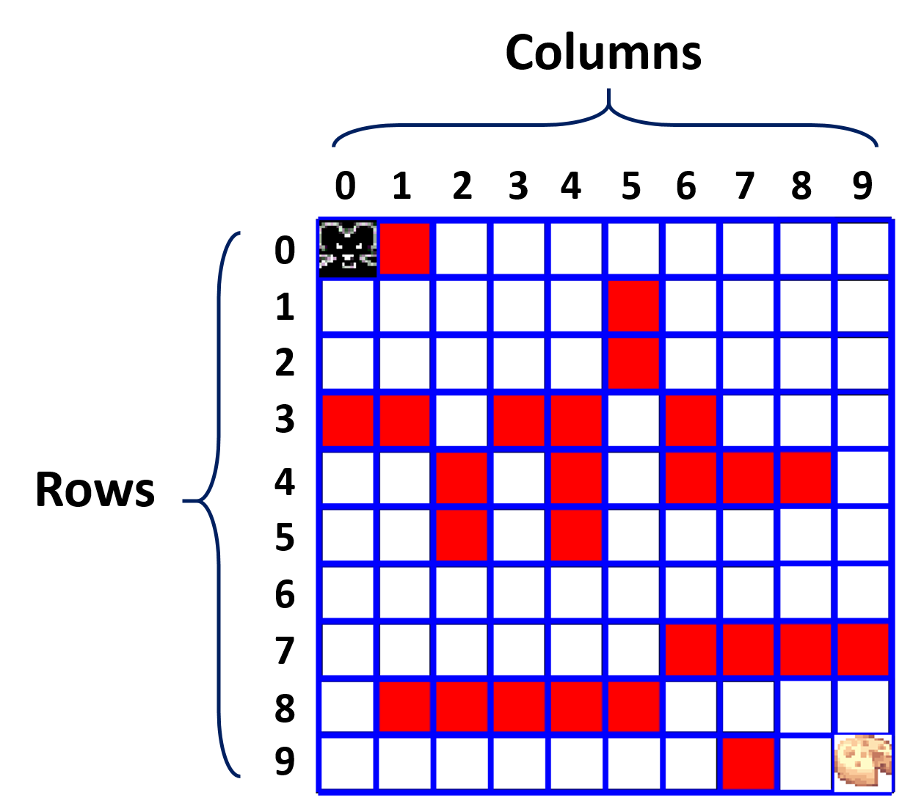

## PyMDP Agent

  

The aim of this project was to create a a interactive agent from scratch. The idea was to create a grid world similary to the above picture. However, in my project the initial state of the agent is unkown and the reward(s) can be placed at any state in the grid.
